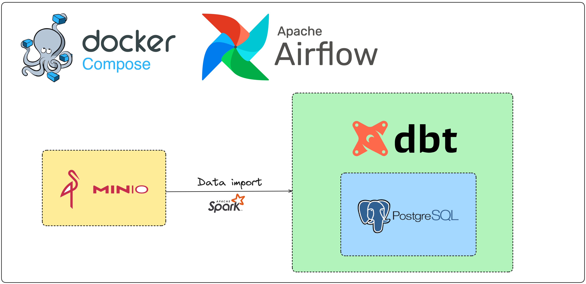
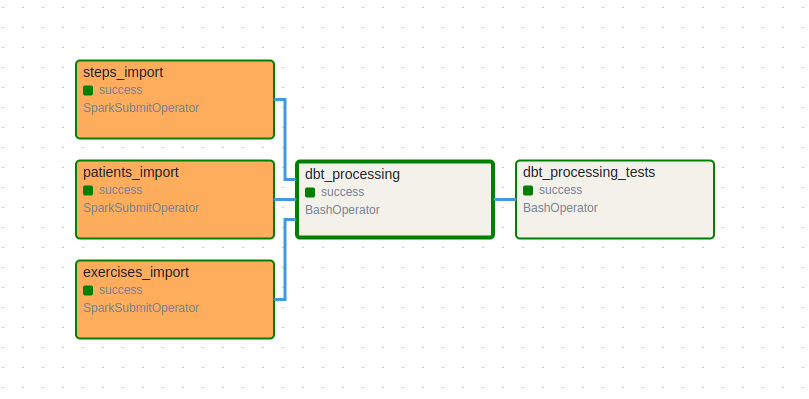
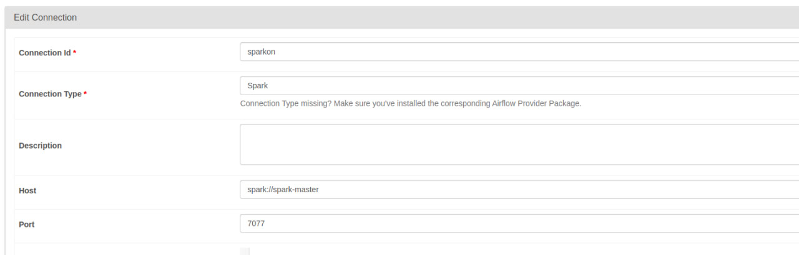

## Solution architecture
### General
The systems imports 3 files from the raw storage into a PostgreSQL 
database and then performs computation SQL manipulations over the data with a DBT pipeline  
The script with the name `patients_with_most_generated_minutes.sql` 
solves the problem `Find the patient(s) with the most generated minutes` 

### Stack
* Python
* PySpark
* DBT
* Apache Airflow
* PostgreSQL
* Docker
* Docker Compose
### Architecture

### DBT lineage

### Airflow DAG

## Project structure
### [Components folder](components)
#### Includes:  
* [loader](components/loader): PySpark job to import data from the raw storage
* [processing](components/processing): DBT pipeline to process data within the DWH
* [raw_storage](components/raw_storage): contains original files from the assignment with changed names

### [Dags folder](dags)
Contains the processing DAG
### [Init scrips folder](init_dwh_scripts)
Contains the SQL script which is applied to the DWH database to create sources table during 
the initialization
### [Pictures folder](pictures)
Contains pictures which are used within this README
### [Dockerfile](Dockerfile)
Custom Dockerfile which is an extension of the official Apache Airflow Dockerfile with 
the SparkSubmitOperator and DBT dependencies
### [.env](.env)
Contains ENV variables with mostly sensitive information
### [docker-compose.yml](docker-compose.yml)
The file to start up Airflow, Spark Master and Worker nodes, MinIO, PostgreSQL for DWH
### [mac_prepare_env.sh](mac_prepare_env.sh) and [ubuntu_prepare_env.sh.sh](ubuntu_prepare_env.sh.sh) scripts
Scripts which are used to download required by your OS dependencies and make the initial set up

## Instructions for starting up the solution
### Notes
* I use Ubuntu. There might be issues during the startup of the solution on other operating systems. Also I didn't prepare any instructions for Windows
* Unfortunately, I didn't find ways to do some things and got tired. In order to run everything a couple of manual actions are required
* I've built the DBT pipeline pretending that it's a columnar database and kind of "real" analytical system

### Instructions
1. Please use [this](mac_prepare_env.sh) or [this](ubuntu_prepare_env.sh.sh) files to install missing dependencies and build required Docker image
2. Run `docker compose up` in the root folder and wait for 2-3 minutes
3. Login to MinIO(the link can be find below). Open the only existing bucket which is called `source` and put files from [data](components/raw_storage/data) in there
4. Open Apache Airflow UI (the link can be find below) and create a Spark connector like on the picture 
5. Open the DAGs list on the Airflow UI and find the DAG. You can use my name as the tag which is `Martin`. Then just run the DAG 

### Helper to the services via a browser
#### Spark UI 
http://localhost:8081/  
No auth
#### MinIO
http://localhost:9001/   
User: datauser  
Password: password
#### Airflow UI
http://localhost:8080/   
User: airflow  
Password: airflow
#### DWH database
http://localhost:5430/   
User: datauser  
Password: password
